# Portfolio
>

🇺🇸

Here is my personal portfolio. Recalling the most part of my job is in private roles, therefore, I can't share it here!

🇧🇷

Aqui está o meu portifólio pessoal. Lembrando que a maior parte do meu trabalho foram em projetos privados, portanto, eu não posso compartilha-los aqui!

>

# [Fake Login](https://github.com/dosSantos-Paulo/androidDevelop/tree/main/02_Android/19_FAKE_LOGIN)

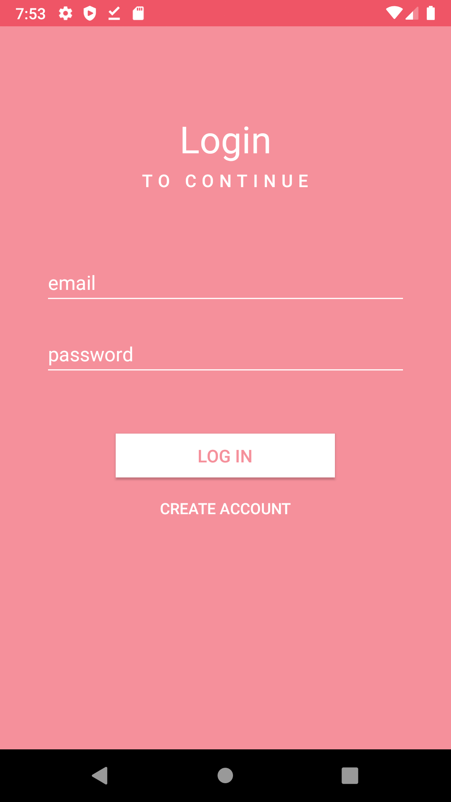

>

# [Foods](https://github.com/dosSantos-Paulo/digitalHouse_Foods)

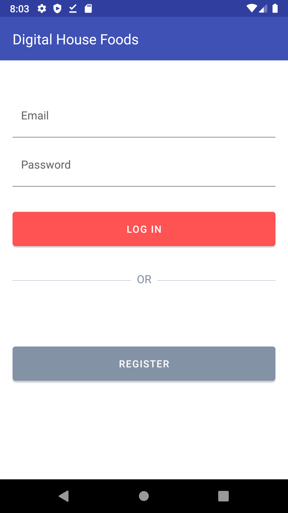   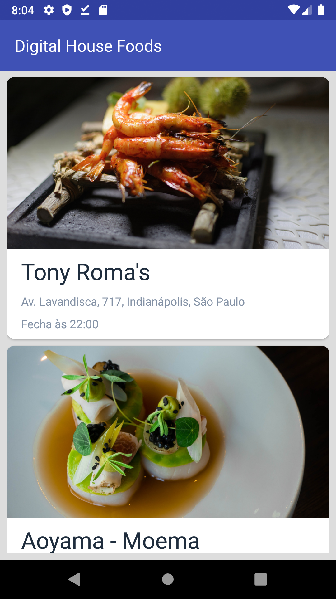   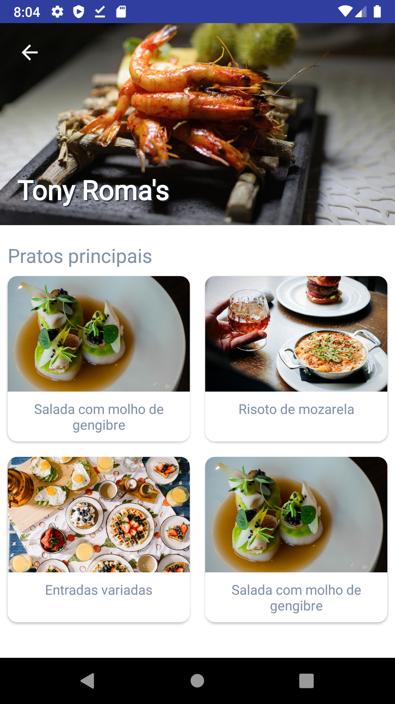

>

# [Hq](https://github.com/dosSantos-Paulo/MarvelHQs)

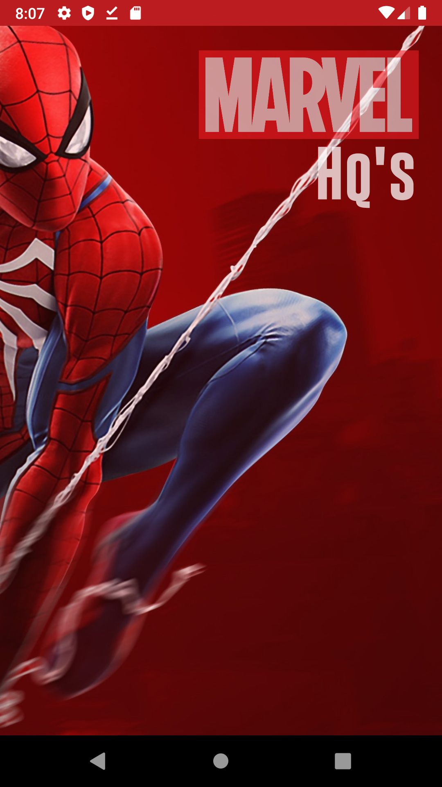   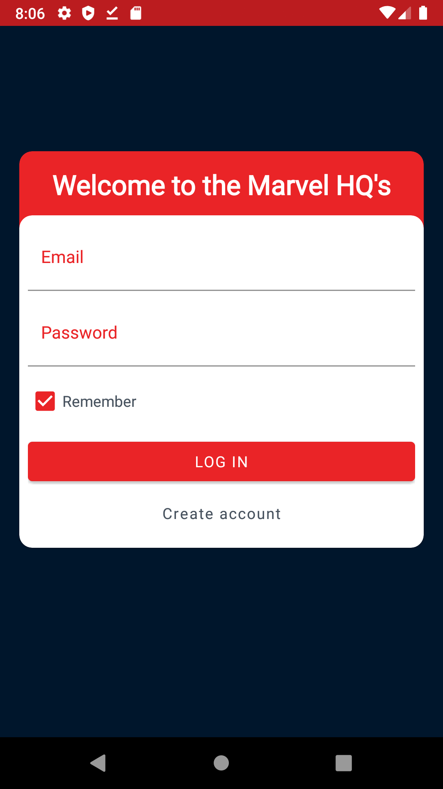   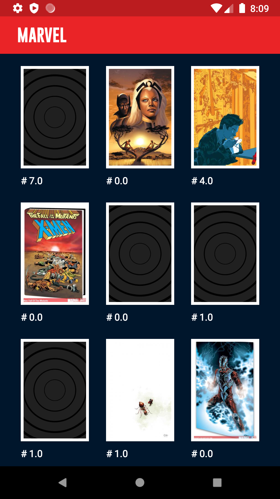   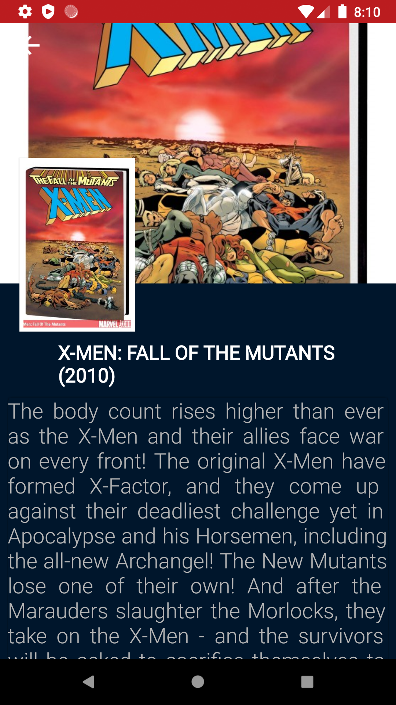

>

# [Marvel My Hero](https://github.com/dosSantos-Paulo/marvelMyHero)

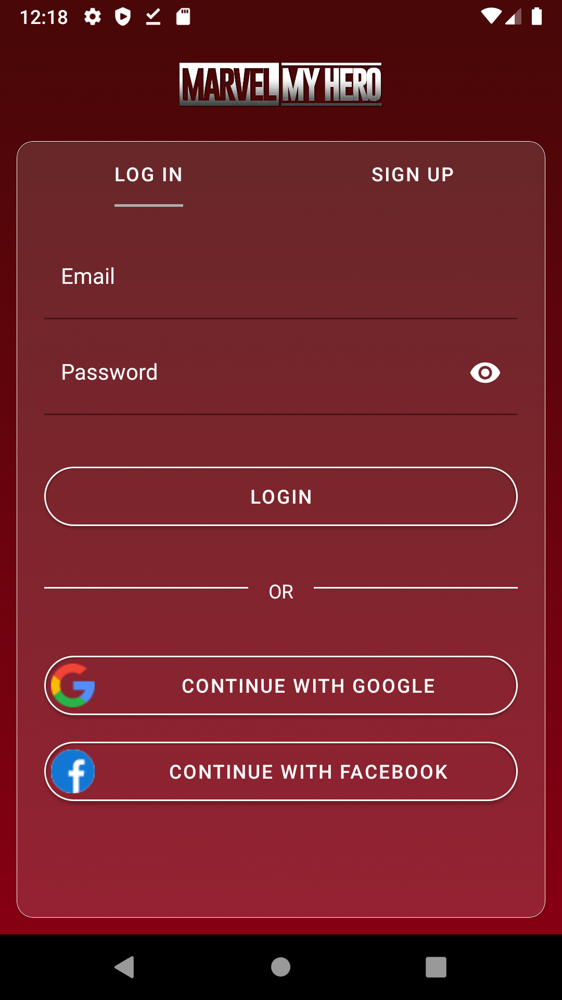   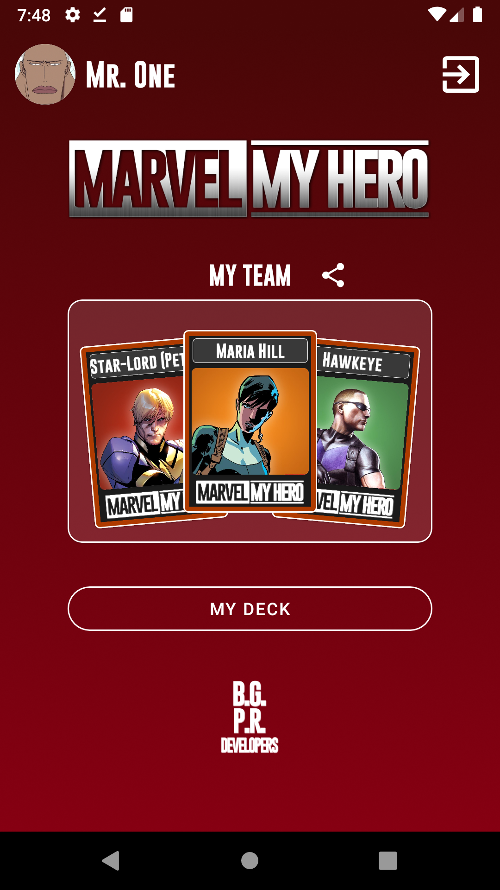   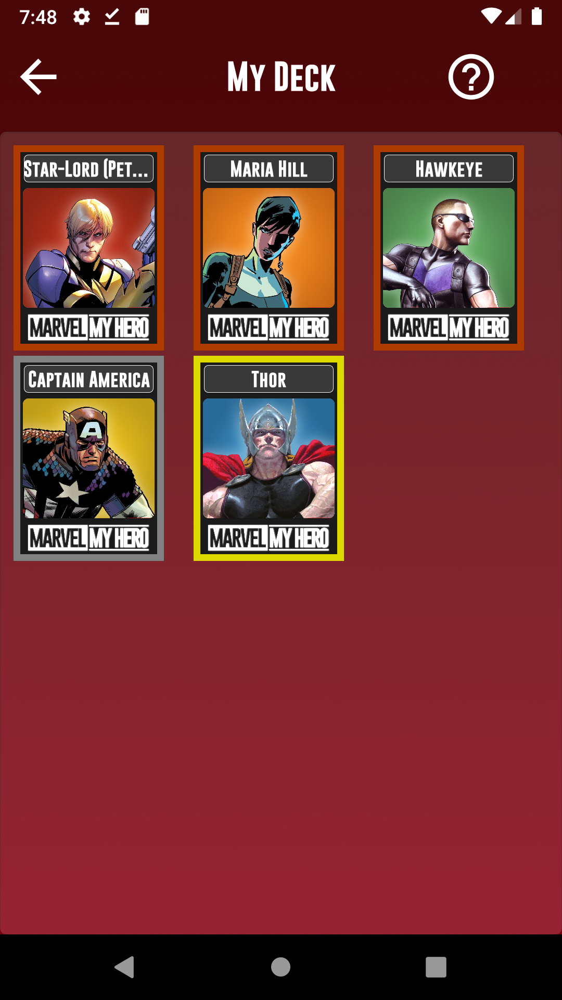   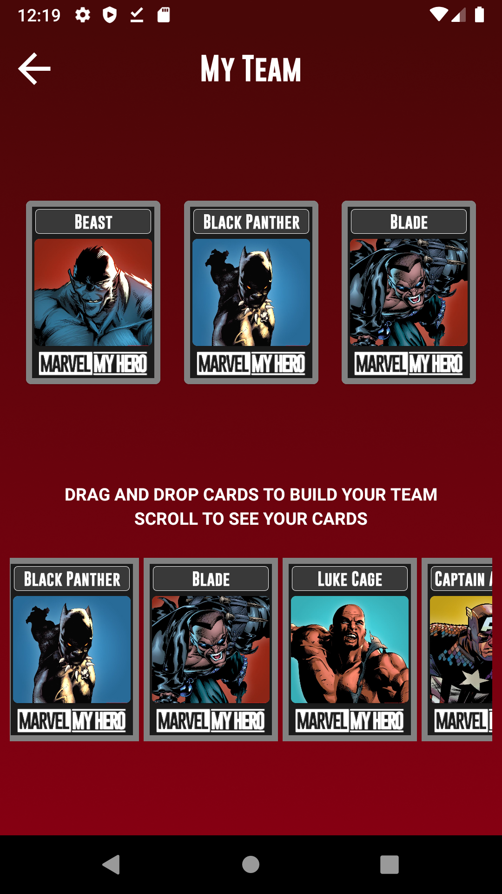

>

🇺🇸

Can you see another projects in Java, javaScript, Swift, Objective-C and another tests in my repository. Just click [here!](https://github.com/dosSantos-Paulo?tab=repositories)

🇧🇷

Você pode ser outros projetos em Java, javaScript, Swift, Objective-Ce outros testes no meu repositório. Basta clicar [aqui!](https://github.com/dosSantos-Paulo?tab=repositories)

>